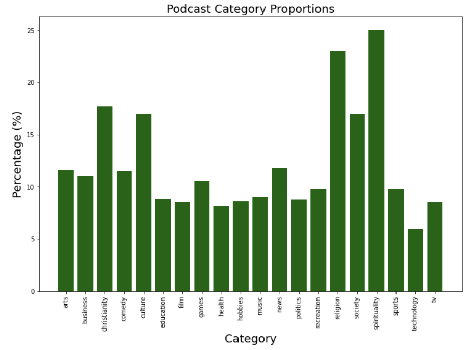
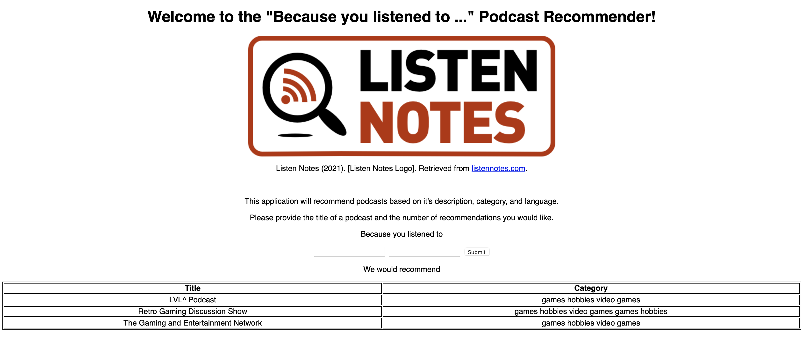

# Work in Progress 
# Welcome to my Content Based Podcast Recommender

  

This repository creates a web application to recommend offbeat podcasts based on user input. Recommendations are determined using calculated similarities between key words that the user will provide and the text description of each podcast. Let's get started!

## The Data

The data was downloaded from [Kaggle](https://www.kaggle.com/listennotes/all-podcast-episodes-published-in-december-2017?select=podcasts.csv) but originates from the [Listen Notes](https://www.listennotes.com) database. The attributes used for this recommender were:

1. **uuid**: the unique id to reference the podcast

2. **title**: the title of the podcast

3. **description**: the short text that describes the content of the podcast

4. **category**: the category the podcast was assigned to

5. **language**: the language the podcast was assigned to

## Exploration

Since the recommender was built on the text descriptions associated with each podcast, let's take a look at them.

### The Descriptions

Here is a word cloud of the most common words in the text descriptions. As you can see, "podcast" is the most popular word, which comes at no surprise. However, if you look closer, you can see words such as: "business", "music", "world", "church", and "learn", which show the diversity among the podcast topics.

  

### The Categories

This dataset had 83 categories each podcast could be assigned to. However, some categories were rare compared to others, so below is a bar plot of the categories that were more than 5% of the overall dataset. After further calculation, the 5 most common categories were spirituality, religion, Christianity, culture, and society.

  

### The Languages

This dataset also had 37 unique languages that these podcasts were assigned to. After some calculations, the majority of the podcasts were in English, and the rest of the languages hold a small percentage individually. Below is a table of the 10 most common languages and their respective proportion of the overall dataset.

| Language  | Percentage  |
| :---------: | :-----------: |
| English | 81.75%  |
| German  | 3.61% |
| French  | 3.28% |
| Spanish | 3.01% |
| Portuguese  | 1.55% |
| Swedish | 1.43% |
| Chinese | 1.10% |
| Japanese | 0.89%  |
| Italian | 0.67% |
| Russian | 0.51% |

## The Recommender

To see the details of how this recommender was created, please refer to the [recommender folder](recommender). This is a content-based recommender, which means that the podcasts are compared based on key words from their descriptions, categories, and languages. After vectorizing the key words, a feature matrix was created. Each row was a podcast, and each column was a key word with the cell being the number of times that word was used in that podcast's content. Therefore, each podcast now has a vector to describe it's content. Then, utilizing cosine similarity, the similarity score of each combination of podcasts was recorded into a new matrix. Referencing these similarity scores, the recommender was able to sort and pull the most similar podcasts. As for a sanity check, the recommender also returns the categories of each podcast to validate whether the recommendations are in fact similar.

## The Web Application

To see this recommender in action, please refer to the [app folder](app). Users will be asked to input a podcast they enjoy and the number of recommendations they would like. Below is a sample output for when the user asks for 3 similar recommendations for the podcast, *So Game We All*.

  

You can check it out for yourself [here](http://54.183.20.183:8080/)!

Please reach out to me if you would like to check it out! I might have the AWS EC2 off to avoid unnecessary costs.

## For the Future

In my opinion, I believe this recommender works well. However, there is always room for improvement. One way I would like to touch up on this recommender would be to utilize a dataset or some additional data that would allow me to filter for the most popular podcasts. I believe this would make the recommender more relevant to more people given that some of these podcasts are not well known.
