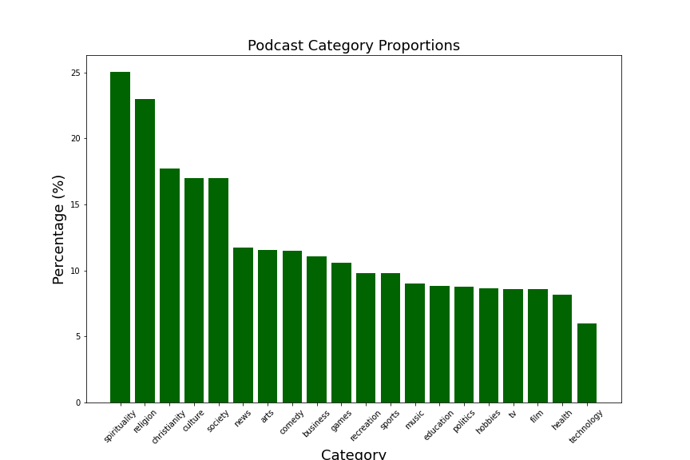

# Welcome to my Content Based Podcast Recommender

  

This repository creates a web application to recommend offbeat podcasts based on user input. Recommendations are determined using calculated similarities between key words that the user will provide and the text description of each podcast. Let's get started!

## The Data

The data was downloaded from [Kaggle](https://www.kaggle.com/listennotes/all-podcast-episodes-published-in-december-2017?select=podcasts.csv) but originates from the [Listen Notes](https://www.listennotes.com) database. The attributes used for this recommender were:

1. **uuid**: the unique id to reference the podcast

2. **title**: the title of the podcast

3. **description**: the short text that describes the content of the podcast

4. **category**: the category the podcast was assigned to

5. **language**: the language the podcast was assigned to

## Exploration

Let's take a look at the data!

### The Categories

This dataset had 83 categories each podcast could be assigned to. However, some categories were rare compared to others, so below is a bar plot of the categories that were more than 5% of the overall dataset. After further calculation, the 5 most common categories were spirituality, religion, Christianity, culture, and society.

  

## The Recommender

To see the details of how this recommender was created, please refer to the [recommender.py in the app folder](app). This is a content based recommender, which means that the recommendations are determined by the similarity in the key words and the descriptions of each podcast. Using sklearn's TFIDF vectorizer, each podcast, or row, now is the calculated weights of each word for each document (podcast). Then, utilizing cosine similarity, the similarity score of the user's key words and each podcast vector is recorded and filtered for the largest in order to return the number of recommendations the user would like.

## The Web Application

To see this recommender in action, please refer to the [app folder](app). Users will be asked to input a list of key words they want along with the number of recommendations they would like. Below is a sample output if the user were to input "bigfoot, alien, supernatural, ufo, paranormal" with 3 recommendations.

  

Please reach out to me if you would like to check it out! I might have the AWS EC2 off to avoid unnecessary costs.

## For the Future

Some next steps are:

**- Expand the data base to other languages since it only contains English podcasts**
**- Play with the css style of this web application**
